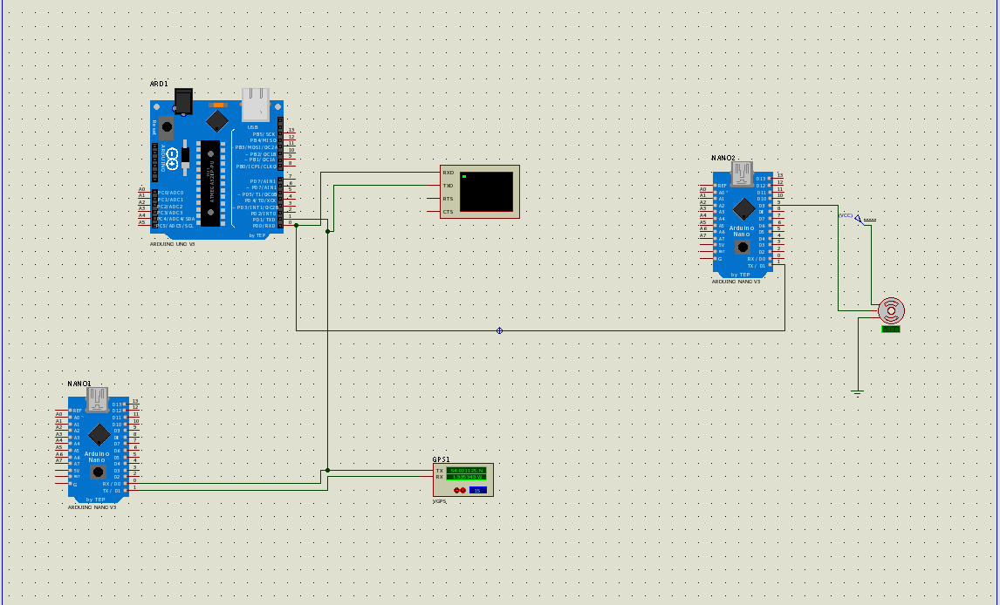

## Rede CAN aplicado no setor aeronautico

### computador central

#### Inicialização do projeto no platformio
platformio project init --board   uno

## Problemas
eu naõ consegui usar o terminal virtual do proteus, então a minha chance era usar um codigo externo observar oque acontecia
o wine e o proteus enviaveam informações para com10 , enão permetiamacesso, portanto compartilhei as informações da porta com as porta 4 , 5, eusei um codigo em python paraler oque acontecia

rm ~/.wine/dosdevices/com10
ln -s /dev/pts/4 ~/.wine/dosdevices/com10
socat  -d -d pty,raw,echo=0 pty,raw,echo=0
